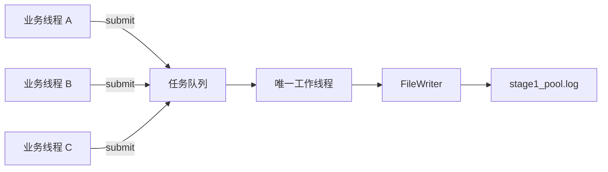
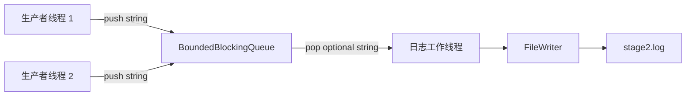

# AsyncLogging

一个使用 C++17 从零实现异步日志库的渐进式学习项目。

目前已经完成：

- Stage 0：同步文件写入；
- Stage 1：单工作线程任务队列与异步日志边界；
- Stage 2：专用有界阻塞队列与双生产者日志写入。

## 当前进度

| 阶段                  | 状态   | 主要内容                                               |
| --------------------- | ------ | ------------------------------------------------------ |
| Stage 0：同步日志     | 已完成 | FD 的 RAII、短写、`EINTR`、`fsync()`               |
| Stage 1：迷你线程池   | 已完成 | 单工作线程、任务队列、条件变量、Drain 关闭、消息所有权 |
| Stage 2：专用异步队列 | 已完成 | 有界阻塞队列、双条件变量、关闭唤醒、Drain 语义         |
| Stage 3：批量写入     | 计划中 | 批量取出日志，减少系统调用                             |
| Stage 4：双缓冲       | 计划中 | `FixedBuffer`、锁内交换、锁外 I/O                    |
| Final：完整日志库     | 计划中 | 格式化、级别、滚动文件、`flush()`、统计与测试        |

## 当前架构

### Stage 0：同步调用

```text
业务线程
   │
   │ SyncLogger::log()
   ▼
FileWriter::append()
   │
   │ write()
   ▼
stage0.log
```

调用 `log()` 的业务线程亲自执行文件 I/O。它还不是异步日志，但先建立了可靠的文件写入层。

### Stage 1：异步执行



Stage 1 的 `log()` 不再直接写文件，而是把拥有完整日志内容的 Lambda 放进任务队列。唯一工作线程依次取出任务并调用 `FileWriter::append()`。

### Stage 2：专用有界日志队列



Stage 2 不再把日志包装成通用的 `std::function<void()>`，而是直接传递 `std::string`。队列容量固定为 1024；队列满时生产者等待，形成最基础的阻塞背压。

## 项目目录

```text
AsyncLogging/
├── CMakeLists.txt
├── README.md
├── .gitignore
└── stages/
    ├── stage0_sync.cpp
    ├── stage1_mini_pool.cpp
    └── stage2_async_queue.cpp
```

`build/` 和运行生成的 `*.log` 已由 `.gitignore` 排除，不会进入 Git 仓库。

## 构建环境

- CMake 3.16 或更高版本；
- 支持 C++17 的 Clang、AppleClang 或 GCC；
- macOS 或 Linux 等提供 POSIX 文件接口的系统；
- 标准线程库支持。

项目使用了以下 POSIX 接口：

```text
open  write  fsync  close  unlink
```

因此当前代码不能直接按原样在 Windows 上编译。

## 配置与编译

在项目根目录执行：

```bash
cmake -S . -B build -DCMAKE_BUILD_TYPE=Debug
cmake --build build -j
```

第一条命令读取 `CMakeLists.txt`，在 `build/` 中生成构建系统；第二条命令编译当前所有目标。

也可以只编译某个阶段：

```bash
cmake --build build --target stage0_sync -j
cmake --build build --target stage1_mini_pool -j
cmake --build build --target stage2_async_queue -j
```

当前可执行目标：

| 目标                   | 源文件                            | 是否需要线程库               |
| ---------------------- | --------------------------------- | ---------------------------- |
| `stage0_sync`        | `stages/stage0_sync.cpp`        | 否                           |
| `stage1_mini_pool`   | `stages/stage1_mini_pool.cpp`   | 是，链接`Threads::Threads` |
| `stage2_async_queue` | `stages/stage2_async_queue.cpp` | 是，链接`Threads::Threads` |

## 运行 Stage 0

```bash
cd build
./stage0_sync
cat stage0.log
```

预期输出：

```text
wrote stage0.log
first synchronous log
同步版本先保证文件写入正确
```

日志文件应正好包含两行：

```bash
wc -l stage0.log
```

```text
2 stage0.log
```

## 运行 Stage 1

如果当前仍在项目根目录：

```bash
cd build
```

如果已经在 `build/` 中，则直接运行：

```bash
./stage1_mini_pool
wc -l stage1_pool.log
head -n 2 stage1_pool.log
tail -n 2 stage1_pool.log
```

预期结果：

```text
wrote 1000 lines to stage1_pool.log
1000 stage1_pool.log
task 0
task 1
task 998
task 999
```

程序使用相对路径创建日志。因此按照上述方式运行时，日志位于：

```text
AsyncLogging/build/stage0.log
AsyncLogging/build/stage1_pool.log
AsyncLogging/build/stage2.log
```

## 运行 Stage 2

在 `build/` 目录中执行：

```bash
./stage2_async_queue
wc -l stage2.log
grep -c '^first producer:' stage2.log
grep -c '^second producer:' stage2.log
```

预期结果：

```text
wrote 2000 lines to stage2.log
2000 stage2.log
1000
1000
```

两个生产者并发提交，因此两组日志在文件中的交错顺序不固定；但唯一消费者串行写文件，所以每条完整日志不会与另一条日志的字节交叉。

## Stage 0 的核心设计

### 文件描述符的 RAII

`FileWriter` 在构造函数中调用 `open()`，在析构函数中调用 `close()`：

```text
构造对象 → 获得文件描述符
对象存活 → 使用文件描述符
析构对象 → 释放文件描述符
```

复制操作被删除，防止两个对象同时认为自己拥有同一个文件描述符，最终重复关闭。

### 短写和 `EINTR`

一次 `write()` 成功不保证全部字节都写完。`append()` 必须循环处理：

```text
written > 0
    推进指针，继续写剩余字节

written == -1 && errno == EINTR
    系统调用被信号中断，重新尝试

其他情况
    返回写入失败
```

`append()` 成功只表示数据已经交给内核；`fsync()` 提供更强的持久化请求，但成本也更高。

### 为什么教学程序调用 `unlink()`

```cpp
::unlink("stage0.log");
```

文件以 `O_APPEND` 模式打开。运行前删除这个确定的测试日志，可以让重复运行仍得到稳定行数。真实服务通常不能在启动时无条件删除历史日志。

## Stage 1 的核心设计

### `log()` 的异步边界

```cpp
bool log(std::string message) {
    message.push_back('\n');
    return pool_.submit(
        [this, owned = std::move(message)] {
            writer_.append(owned);
        }
    );
}
```

这段代码将工作拆成两个阶段：

```text
调用线程：构造完整日志并提交任务
后台线程：执行任务并写入文件
```

当前 `log()` 返回 `true` 只说明任务已被线程池接受，不代表文件写入已经完成，也不代表数据已经通过 `fsync()` 持久化。

### 为什么移动捕获消息

```cpp
owned = std::move(message)
```

任务可能在 `log()` 返回以后才执行，因此不能引用即将销毁的局部字符串。移动捕获把字符串所有权交给 Lambda：

```text
log() 的 message
       │ std::move
       ▼
Lambda 的 owned
       │ submit
       ▼
任务队列
       │ pop
       ▼
后台线程写入
```

只要任务仍存在，日志内容就仍然有效。

### 条件变量为什么需要谓词

工作线程等待：

```cpp
ready_.wait(lock, [this] {
    return stopping_ || !tasks_.empty();
});
```

谓词同时处理三种情况：

- 队列出现新任务；
- 线程池开始关闭；
- 条件变量发生虚假唤醒。

工作线程必须在持有互斥锁时检查共享状态，并在执行任务前释放锁，避免文件 I/O 长时间占用队列锁。

### Drain 关闭

`shutdown()` 的目标是：

```text
停止接收新任务
      ↓
唤醒工作线程
      ↓
执行完已经接受的任务
      ↓
工作线程退出
      ↓
join() 后返回
```

后台线程的退出判断是：

```cpp
if (stopping_ && tasks_.empty()) {
    return;
}
```

不能在看到 `stopping_` 后立即退出，否则队列中已经接受的日志会丢失。

### `LoggerViaPool` 的析构顺序

成员按照声明顺序构造，按照相反顺序析构：

```cpp
FileWriter writer_;
MiniThreadPool pool_;
```

因此销毁时先析构 `pool_`，由它停止并 `join` 后台线程；随后才析构 `writer_` 并关闭文件。这样队列中的任务不会访问已经销毁的文件对象。

## Stage 2 的核心设计

### 为什么从通用线程池改为专用队列

Stage 1 的队列元素是：

```cpp
std::function<void()>
```

但日志后台只做一件事：把字符串写进文件。Stage 2 直接保存：

```cpp
std::string
```

这样数据流更清楚，也为后续批量取出字符串、拼接缓冲区做好准备。

### 为什么需要两个条件变量

```text
not_empty_：消费者等待“队列非空”
not_full_ ：生产者等待“队列未满”
```

`push()` 在队列满时等待：

```cpp
not_full_.wait(lock, [this] {
    return closed_ || queue_.size() < capacity_;
});
```

`pop()` 在队列空时等待：

```cpp
not_empty_.wait(lock, [this] {
    return closed_ || !queue_.empty();
});
```

谓词都包含 `closed_`，确保关闭队列时，正在等待的生产者和消费者能够醒来退出。

### `close()`、`push()`、`pop()` 的顺序

三个操作使用同一个 `mutex_`，因此并发发生时具有明确顺序：

```text
push 先插入 → 该元素属于关闭前已接受的数据
close 先生效 → 后续 push 返回 false
```

`close()` 同时通知两类等待者：

```cpp
not_full_.notify_all();
not_empty_.notify_all();
```

关闭后消费者仍会取完队列中的旧元素；只有 `closed_ == true` 且队列为空时，`pop()` 才返回 `std::nullopt`。

### `optional<T>` 表示队列结束

```cpp
std::optional<T> pop();
```

返回值表达两种不同状态：

```text
包含 T       → 成功取到一个队列元素
std::nullopt → 队列已经关闭并且彻底排空
```

因此后台循环可以写成：

```cpp
while (auto message = queue_.pop()) {
    writer_.append(*message);
}
```

### Stage 2 的 Drain 关闭

`AsyncLogger::shutdown()` 先关闭队列，再等待工作线程：

```text
queue_.close()
      ↓
拒绝新的 push
      ↓
消费者继续取完已有日志
      ↓
pop() 返回 nullopt
      ↓
工作线程退出
      ↓
worker_.join()
```

## 当前版本保证什么

在调用方正确管理 `AsyncLogger` 生命周期的前提下，Stage 2 旨在保证：

- 多个生产者可以通过线程安全的 `push()` 提交日志；
- 队列容量固定，满时生产者等待，不会无限增长；
- 日志字符串由队列拥有，不引用已经销毁的局部变量；
- 唯一工作线程串行访问 `FileWriter`；
- `shutdown()` 处理完已接受任务并等待工作线程退出；
- 重复调用 `shutdown()` 不会重复 `join()`。

## 当前版本尚未解决

- 当前只有阻塞生产者这一种背压策略；
- 每条日志仍对应一次独立的队列操作和文件写入；
- `AsyncLogger::log()` 无法把后台 I/O 失败直接返回给调用者；
- 后台任务目前忽略 `FileWriter::append()` 的返回值；
- 没有批量取出、批量写入和固定大小缓冲区；
- 没有日志级别、时间、线程 ID 和源码位置；
- 没有文件滚动、运行统计和自动化测试；
- 没有定义业务线程调用 `log()` 与对象析构并发发生时的安全保证。

这些限制正是后续阶段要逐一解决的问题。
