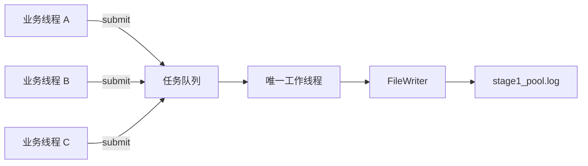
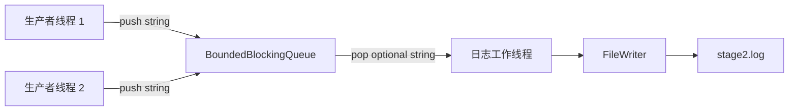
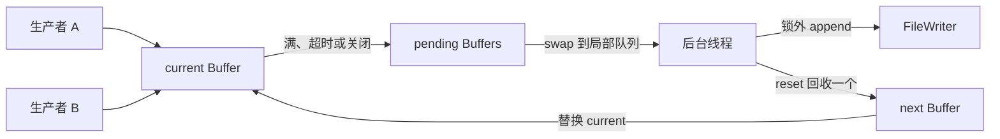

# AsyncLogging

一个使用 C++17 从零实现异步日志库的渐进式学习项目。

目前已经完成：

- Stage 0：同步文件写入；
- Stage 1：单工作线程任务队列与异步日志边界；
- Stage 2：专用有界阻塞队列与双生产者日志写入；
- Stage 3：最多 256 条日志的批量消费与合并写入；
- Stage 4 前置组件：固定容量连续缓冲区及其单元测试；
- Stage 4：固定缓冲区所有权交换与后台批量写入；
- Final 前置组件：可复用的 `FileWriter` 与按大小滚动的 `RollingFile`。

## 当前进度

| 阶段                   | 状态   | 主要内容                                               |
| ---------------------- | ------ | ------------------------------------------------------ |
| Stage 0：同步日志      | 已完成 | FD 的 RAII、短写、`EINTR`、`fsync()`               |
| Stage 1：迷你线程池    | 已完成 | 单工作线程、任务队列、条件变量、Drain 关闭、消息所有权 |
| Stage 2：专用异步队列  | 已完成 | 有界阻塞队列、双条件变量、关闭唤醒、Drain 语义         |
| Stage 3：批量写入      | 已完成 | 批量取出、锁外拼接、合并写入、异常兜底                 |
| Stage 4 前置：固定缓冲 | 已完成 | `FixedBuffer`、容量边界、快速复用、单元测试          |
| Stage 4：双缓冲        | 已完成 | Buffer 所有权转移、定时刷新、阻塞背压、锁外 I/O        |
| Final 前置：滚动文件 | 已完成 | `FileWriter`、`RollingFile`、大小阈值、超大单条、单元测试 |
| Final：完整日志库      | 计划中 | 格式化、级别、`flush()`、统计与更完整的测试            |

## 当前架构

### Stage 0：同步调用

```text
业务线程
   │
   │ SyncLogger::log()
   ▼
FileWriter::append()
   │
   │ write()
   ▼
stage0.log
```

调用 `log()` 的业务线程亲自执行文件 I/O。它还不是异步日志，但先建立了可靠的文件写入层。

### Stage 1：异步执行



Stage 1 的 `log()` 不再直接写文件，而是把拥有完整日志内容的 Lambda 放进任务队列。唯一工作线程依次取出任务并调用 `FileWriter::append()`。

### Stage 2：专用有界日志队列



Stage 2 不再把日志包装成通用的 `std::function<void()>`，而是直接传递 `std::string`。队列容量固定为 1024；队列满时生产者等待，形成最基础的阻塞背压。

### Stage 3：批量消费


Stage 3 把“取一条、写一次”改为“取一批、合并后写一次”。队列锁只保护元素搬移，字符串长度统计、拼接和文件 I/O 都在锁外完成。

### Stage 4 前置：固定缓冲区

```text
多条日志
   │ append(string_view)
   ▼
┌──────────────────────────────┐
│ FixedBuffer<Capacity>        │
│ data_[0, size_)：有效字节     │
│ records_：成功追加次数        │
└──────────────────────────────┘
   │ 满后整体交给后台
   ▼
批量文件写入
```

`FixedBuffer` 使用编译期固定容量的连续数组，追加过程中不自动扩容。当前先把它作为独立组件实现并测试，再接入双缓冲日志器。

### Stage 4：双缓冲日志器



生产者只向 `current_` 追加；当前缓冲放不下时，将其所有权移动到 `pending_`，再换上 `next_` 或新缓冲。后台线程快速把 `pending_` 交换到局部容器，释放锁后再执行文件 I/O，因此生产者和磁盘写入可以使用不同 Buffer 并行工作。

### Final 前置：滚动文件

```text
RollingFile::append(data)
          │
          ├─ 当前文件仍能容纳 ───▶ FileWriter::append(data)
          │
          └─ 追加后会超过阈值
                     │
                     ▼
              先打开新文件
                     │ 成功
                     ▼
              替换 writer_ 后写入
```

`RollingFile` 不自己处理短写和 `EINTR`，而是复用 `FileWriter`。它在追加整条数据之前检查大小；如果当前文件非空且新数据会越过阈值，就先滚动再写入。一条数据本身大于阈值时，仍会被完整写入一个新文件，不会拆分或丢弃。

## 项目目录

```text
AsyncLogging/
├── CMakeLists.txt
├── README.md
├── .gitignore
├── stages/
│   ├── stage0_sync.cpp
│   ├── stage1_mini_pool.cpp
│   ├── stage2_async_queue.cpp
│   ├── stage3_batch.cpp
│   └── stage4_double_buffer.cpp
├── final/
│   ├── minilog/
│   │   ├── file_writer.hpp
│   │   ├── fixed_buffer.hpp
│   │   └── rolling_file.hpp
│   └── src/
│       ├── file_writer.cpp
│       └── rolling_file.cpp
└── tests/
    ├── fixed_buffer_test.cpp
    ├── rolling_file_test.cpp
    └── test_support.hpp
```

`build/` 和运行生成的 `*.log` 已由 `.gitignore` 排除，不会进入 Git 仓库。

## 构建环境

- CMake 3.16 或更高版本；
- 支持 C++17 的 Clang、AppleClang 或 GCC；
- macOS 或 Linux 等提供 POSIX 文件接口的系统；
- 标准线程库支持。

项目使用了以下 POSIX 接口：

```text
open  write  fsync  close  unlink
```

因此当前代码不能直接按原样在 Windows 上编译。

## 配置与编译

在项目根目录执行：

```bash
cmake -S . -B build -DCMAKE_BUILD_TYPE=Debug
cmake --build build -j
```

第一条命令读取 `CMakeLists.txt`，在 `build/` 中生成构建系统；第二条命令编译当前所有目标。

也可以只编译某个阶段：

```bash
cmake --build build --target stage0_sync -j
cmake --build build --target stage1_mini_pool -j
cmake --build build --target stage2_async_queue -j
cmake --build build --target stage3_batch -j
cmake --build build --target stage4_double_buffer -j
cmake --build build --target fixed_buffer_test -j
cmake --build build --target rolling_file_test -j
```

当前构建目标：

| 目标                     | 源文件                              | 是否需要线程库               |
| ------------------------ | ----------------------------------- | ---------------------------- |
| `stage0_sync`          | `stages/stage0_sync.cpp`          | 否                           |
| `stage1_mini_pool`     | `stages/stage1_mini_pool.cpp`     | 是，链接`Threads::Threads` |
| `stage2_async_queue`   | `stages/stage2_async_queue.cpp`   | 是，链接`Threads::Threads` |
| `stage3_batch`         | `stages/stage3_batch.cpp`         | 是，链接`Threads::Threads` |
| `stage4_double_buffer` | `stages/stage4_double_buffer.cpp` | 是，链接`Threads::Threads` |
| `fixed_buffer_test`    | `tests/fixed_buffer_test.cpp`     | 否                           |
| `minilog_file`         | `final/src/file_writer.cpp`、`rolling_file.cpp` | 否，静态库 |
| `rolling_file_test`    | `tests/rolling_file_test.cpp`     | 否，链接 `minilog_file` |

## 运行 Stage 0

```bash
cd build
./stage0_sync
cat stage0.log
```

预期输出：

```text
wrote stage0.log
first synchronous log
同步版本先保证文件写入正确
```

日志文件应正好包含两行：

```bash
wc -l stage0.log
```

```text
2 stage0.log
```

## 运行 Stage 1

如果当前仍在项目根目录：

```bash
cd build
```

如果已经在 `build/` 中，则直接运行：

```bash
./stage1_mini_pool
wc -l stage1_pool.log
head -n 2 stage1_pool.log
tail -n 2 stage1_pool.log
```

预期结果：

```text
wrote 1000 lines to stage1_pool.log
1000 stage1_pool.log
task 0
task 1
task 998
task 999
```

程序使用相对路径创建日志。因此按照上述方式运行时，日志位于：

```text
AsyncLogging/build/stage0.log
AsyncLogging/build/stage1_pool.log
AsyncLogging/build/stage2.log
AsyncLogging/build/stage3.log
```

## 运行 Stage 2

在 `build/` 目录中执行：

```bash
./stage2_async_queue
wc -l stage2.log
grep -c '^first producer:' stage2.log
grep -c '^second producer:' stage2.log
```

预期结果：

```text
wrote 2000 lines to stage2.log
2000 stage2.log
1000
1000
```

两个生产者并发提交，因此两组日志在文件中的交错顺序不固定；但唯一消费者串行写文件，所以每条完整日志不会与另一条日志的字节交叉。

## 运行 Stage 3

在 `build/` 目录中执行：

```bash
./stage3_batch
wc -l stage3.log
head -n 2 stage3.log
tail -n 2 stage3.log
```

预期结果：

```text
wrote 10000 batched lines to stage3.log
10000 stage3.log
batched log: 0
batched log: 1
batched log: 9998
batched log: 9999
```

程序启动时会删除确定的教学输出 `stage3.log`，因此重复运行仍应得到 10000 行。

## 运行 Stage 4

在 `build/` 目录中执行：

```bash
./stage4_double_buffer
wc -l stage4.log
grep -c '^producer A:' stage4.log
grep -c '^producer B:' stage4.log
```

预期结果：

```text
wrote 10000 lines to stage4.log
10000 stage4.log
5000
5000
```

两个生产者的日志交错顺序由线程调度决定；验收重点是总数 10000、每个生产者各 5000，并且每一行保持完整。

## 运行 FixedBuffer 单元测试

推荐通过 CTest 运行：

```bash
cmake --build build --target fixed_buffer_test -j
ctest --test-dir build -R fixed_buffer_test --output-on-failure
```

预期结果：

```text
Start 1: fixed_buffer_test
1/1 Test #1: fixed_buffer_test ... Passed
100% tests passed, 0 tests failed out of 1
```

测试成功时通常不会打印额外正文；任一 `TEST_REQUIRE(...)` 失败时，程序会报告表达式、文件和行号并终止。

也可以在 `build/` 目录直接运行：

```bash
./fixed_buffer_test
```

## 运行 RollingFile 单元测试

```bash
cmake --build build --target rolling_file_test -j
ctest --test-dir build -R rolling_file_test --output-on-failure
```

测试会在系统临时目录创建一个唯一子目录，以 10 字节为滚动阈值，依次写入 6、6、20 和 1 字节的数据。预期生成 4 个文件，按文件名排序后拼接内容，应与原始写入顺序完全一致。测试通过后会删除临时目录。

运行全部测试：

```bash
ctest --test-dir build --output-on-failure
```

当前应看到 `fixed_buffer_test` 和 `rolling_file_test` 两项测试全部通过。

## Stage 0 的核心设计

### 文件描述符的 RAII

`FileWriter` 在构造函数中调用 `open()`，在析构函数中调用 `close()`：

```text
构造对象 → 获得文件描述符
对象存活 → 使用文件描述符
析构对象 → 释放文件描述符
```

复制操作被删除，防止两个对象同时认为自己拥有同一个文件描述符，最终重复关闭。

### 短写和 `EINTR`

一次 `write()` 成功不保证全部字节都写完。`append()` 必须循环处理：

```text
written > 0
    推进指针，继续写剩余字节

written == -1 && errno == EINTR
    系统调用被信号中断，重新尝试

其他情况
    返回写入失败
```

`append()` 成功只表示数据已经交给内核；`fsync()` 提供更强的持久化请求，但成本也更高。

### 为什么教学程序调用 `unlink()`

```cpp
::unlink("stage0.log");
```

文件以 `O_APPEND` 模式打开。运行前删除这个确定的测试日志，可以让重复运行仍得到稳定行数。真实服务通常不能在启动时无条件删除历史日志。

## Stage 1 的核心设计

### `log()` 的异步边界

```cpp
bool log(std::string message) {
    message.push_back('\n');
    return pool_.submit(
        [this, owned = std::move(message)] {
            writer_.append(owned);
        }
    );
}
```

这段代码将工作拆成两个阶段：

```text
调用线程：构造完整日志并提交任务
后台线程：执行任务并写入文件
```

当前 `log()` 返回 `true` 只说明任务已被线程池接受，不代表文件写入已经完成，也不代表数据已经通过 `fsync()` 持久化。

### 为什么移动捕获消息

```cpp
owned = std::move(message)
```

任务可能在 `log()` 返回以后才执行，因此不能引用即将销毁的局部字符串。移动捕获把字符串所有权交给 Lambda：

```text
log() 的 message
       │ std::move
       ▼
Lambda 的 owned
       │ submit
       ▼
任务队列
       │ pop
       ▼
后台线程写入
```

只要任务仍存在，日志内容就仍然有效。

### 条件变量为什么需要谓词

工作线程等待：

```cpp
ready_.wait(lock, [this] {
    return stopping_ || !tasks_.empty();
});
```

谓词同时处理三种情况：

- 队列出现新任务；
- 线程池开始关闭；
- 条件变量发生虚假唤醒。

工作线程必须在持有互斥锁时检查共享状态，并在执行任务前释放锁，避免文件 I/O 长时间占用队列锁。

### Drain 关闭

`shutdown()` 的目标是：

```text
停止接收新任务
      ↓
唤醒工作线程
      ↓
执行完已经接受的任务
      ↓
工作线程退出
      ↓
join() 后返回
```

后台线程的退出判断是：

```cpp
if (stopping_ && tasks_.empty()) {
    return;
}
```

不能在看到 `stopping_` 后立即退出，否则队列中已经接受的日志会丢失。

### `LoggerViaPool` 的析构顺序

成员按照声明顺序构造，按照相反顺序析构：

```cpp
FileWriter writer_;
MiniThreadPool pool_;
```

因此销毁时先析构 `pool_`，由它停止并 `join` 后台线程；随后才析构 `writer_` 并关闭文件。这样队列中的任务不会访问已经销毁的文件对象。

## Stage 2 的核心设计

### 为什么从通用线程池改为专用队列

Stage 1 的队列元素是：

```cpp
std::function<void()>
```

但日志后台只做一件事：把字符串写进文件。Stage 2 直接保存：

```cpp
std::string
```

这样数据流更清楚，也为后续批量取出字符串、拼接缓冲区做好准备。

### 为什么需要两个条件变量

```text
not_empty_：消费者等待“队列非空”
not_full_ ：生产者等待“队列未满”
```

`push()` 在队列满时等待：

```cpp
not_full_.wait(lock, [this] {
    return closed_ || queue_.size() < capacity_;
});
```

`pop()` 在队列空时等待：

```cpp
not_empty_.wait(lock, [this] {
    return closed_ || !queue_.empty();
});
```

谓词都包含 `closed_`，确保关闭队列时，正在等待的生产者和消费者能够醒来退出。

### `close()`、`push()`、`pop()` 的顺序

三个操作使用同一个 `mutex_`，因此并发发生时具有明确顺序：

```text
push 先插入 → 该元素属于关闭前已接受的数据
close 先生效 → 后续 push 返回 false
```

`close()` 同时通知两类等待者：

```cpp
not_full_.notify_all();
not_empty_.notify_all();
```

关闭后消费者仍会取完队列中的旧元素；只有 `closed_ == true` 且队列为空时，`pop()` 才返回 `std::nullopt`。

### `optional<T>` 表示队列结束

```cpp
std::optional<T> pop();
```

返回值表达两种不同状态：

```text
包含 T       → 成功取到一个队列元素
std::nullopt → 队列已经关闭并且彻底排空
```

因此后台循环可以写成：

```cpp
while (auto message = queue_.pop()) {
    writer_.append(*message);
}
```

### Stage 2 的 Drain 关闭

`AsyncLogger::shutdown()` 先关闭队列，再等待工作线程：

```text
queue_.close()
      ↓
拒绝新的 push
      ↓
消费者继续取完已有日志
      ↓
pop() 返回 nullopt
      ↓
工作线程退出
      ↓
worker_.join()
```

## Stage 3 的核心设计

### 每批最多取 256 条

```cpp
while (queue_.take_batch(messages, 256)) {
    // 处理当前批次
}
```

队列实际取出数量必须是：

```cpp
const std::size_t count =
    std::min(queue_.size(), max_count);
```

这里必须使用 `std::min`。如果队列只有 10 条却使用 `std::max(..., 256)`，循环会在第 11 次访问空队列，产生未定义行为。

`256` 只是单批上限，不表示消费者必须等满 256 条：第一条日志到达时消费者就会被唤醒，并取走当时已经排队的最多 256 条。低负载下批次可能只有 1 条，延迟较低；高负载产生积压后，批次才会自然变大。

### 锁内只搬移元素

`take_batch()` 持锁完成以下操作：

```text
等待队列非空或关闭
      ↓
确定本批数量
      ↓
把队列元素 move 到 vector
      ↓
从队列删除这些元素
      ↓
释放队列锁
```

完成搬移后才通知等待队列空间的生产者。消费者不会在持锁期间执行字符串拼接或文件 I/O，避免生产者被慢磁盘长时间阻塞。

### 为什么先统计总字节数

后台线程先计算本批消息总长度：

```cpp
std::size_t bytes = 0;
for (const auto& message : messages) {
    bytes += message.size();
}

batch.clear();
batch.reserve(bytes);
```

`reserve(bytes)` 让 `batch` 一次预留足够空间，减少随后多次 `append()` 引起的扩容和内存复制。

### 合并写入的收益与代价

Stage 2 的近似路径：

```text
取 256 条日志 → 最多调用 256 次 FileWriter::append()
```

Stage 3 的路径：

```text
取 256 条日志 → 拼成一个 batch → 调用 1 次 FileWriter::append()
```

这能显著减少 `write()` 系统调用次数，但当前版本仍需要：

- 为每条日志保存一个 `std::string`；
- 把每条日志再复制到 `batch`；
- 使用 `std::vector<std::string>` 保存批次。

这些分配和复制将在固定缓冲与双缓冲阶段继续优化。

### 最后一个不足 256 条的批次

关闭后队列仍然允许消费者取出剩余数据：

```text
close()
   ↓
拒绝新日志
   ↓
take_batch() 取出最后 1～255 条
   ↓
写完最后批次
   ↓
队列为空且已关闭，take_batch() 返回 false
   ↓
工作线程退出并 join
```

因此“批量大小为 256”不要求日志总数必须是 256 的整数倍。

## FixedBuffer 的核心设计

### 为什么模板实现放在头文件

```cpp
template <std::size_t Capacity>
class FixedBuffer;
```

`Capacity` 是编译期非类型模板参数。编译器在看到 `FixedBuffer<8>`、`FixedBuffer<64 * 1024>` 等具体实例时，需要同时看到完整模板定义，所以当前组件直接实现在：

```text
final/minilog/fixed_buffer.hpp
```

它不需要单独的 `.cpp` 文件或静态库。CMake 只需让测试目标能够从 `final/` 找到 `minilog/fixed_buffer.hpp`。

### 四个核心不变量

```text
0 <= size_ <= Capacity
data_[0, size_) 是有效字节
available() == Capacity - size_
append() 要么完整成功，要么完全不修改状态
```

数据没有额外的 `\0` 终止符，因此读取时必须同时使用 `data()` 和 `size()`：

```cpp
std::string_view bytes(buffer.data(), buffer.size());
```

### 为什么 `reset()` 不清零数组

```cpp
void reset() noexcept {
    size_ = 0;
    records_ = 0;
}
```

有效范围由 `[0, size_)` 定义。重置元数据后，旧字节即使仍留在数组里，也不再属于有效内容；下一次追加会从下标 0 开始覆盖。因此 `reset()` 是 O(1)，不用每次遍历并清零整个缓冲区。

### 单元测试覆盖什么

`FixedBuffer<8>` 使用很小的容量，专门覆盖边界：

```text
初始为空、可用容量为 8
追加 7 字节成功
再追加 1 字节，恰好填满
追加第 9 字节失败
失败后 size 和 records 不变
reset 后恢复为空并能再次追加
```

测试使用 `TEST_REQUIRE`，而不是可能在 Release 构建中被 `NDEBUG` 删除的标准 `assert()`。这样无论 Debug 还是 Release，测试表达式都会执行。

## Stage 4 的核心设计

### 三类 Buffer 的职责

```text
current_：生产者正在追加日志
next_   ：预留的空 Buffer，切换时优先复用
pending_：已提交、等待后台线程写入的 Buffer
```

它们都由 `std::unique_ptr` 管理。切换时只转移指针所有权，不复制 64 KiB 的数组：

```cpp
pending_.push_back(std::move(current_));
current_ = next_
    ? std::move(next_)
    : std::make_unique<Buffer>();
```

### 前台追加与阻塞背压

单条日志先追加换行，并拒绝超过 Buffer 容量的消息。当前 Buffer 放不下时，生产者等待：

```cpp
space_available_.wait(lock, [this] {
    return !running_
        || pending_.size() < max_pending_buffers_;
});
```

如果待写 Buffer 已达到上限，生产者阻塞，防止共享积压无限增长。等待会释放互斥锁，使后台线程能够取走 `pending_`。

重新获得锁后必须再次检查 `current_->available()`：等待期间，后台线程可能已经定时提交了原来的半满 Buffer，并换上新的空 Buffer。

### 定时提交半满 Buffer

后台线程使用：

```cpp
work_available_.wait_for(
    lock,
    flush_interval_,
    [this] {
        return !running_ || !pending_.empty();
    }
);
```

等待结束可能是因为有写满 Buffer、开始关闭或定时器超时。即使流量很低，超时后也会把非空 `current_` 交给后台，避免少量日志长期停留在内存中。

### 锁内交换，锁外 I/O

后台在线程共享锁内执行：

```cpp
pending_.swap(buffers_to_write);
```

交换后，共享 `pending_` 立即变空，后台线程独占局部 `buffers_to_write`。离开锁作用域后才遍历 Buffer 并调用 `writer_.append()`，因此慢速磁盘 I/O 不会一直占用生产者需要的互斥锁。

### 为什么只回收一个备用 Buffer

写完后，后台线程从本批取出一个 Buffer：

```cpp
BufferPtr recycled =
    std::move(buffers_to_write.back());
recycled->reset();
```

如果 `next_` 为空，就把它保存为备用缓冲；其余 Buffer 随局部队列清空而释放。这样正常运行时可以复用 Buffer，同时避免流量洪峰结束后长期保留大量 64 KiB 内存块。

### Stage 4 的 Drain 关闭

```text
running_ = false
      ↓
唤醒后台线程和被背压阻塞的生产者
      ↓
提交最后一个非空 current_
      ↓
写完 pending_ 和本地待写 Buffer
      ↓
确认没有剩余数据
      ↓
工作线程退出并 join
```

后台不能在看到 `running_ == false` 时立即退出；只有已经接受的数据全部尝试写出后才能结束。

## RollingFile 的核心设计

### 为什么抽成 `minilog_file` 静态库

`FileWriter` 和 `RollingFile` 不是单个演示程序，而是后续完整日志器要复用的组件。CMake 将它们编译成：

```text
libminilog_file.a
```

`target_include_directories(minilog_file PUBLIC .../final)` 表示：库自己及链接该库的目标，都可以使用：

```cpp
#include "minilog/rolling_file.hpp"
```

因此 `rolling_file_test` 只需链接 `minilog_file`，无需再重复配置头文件查找路径。

### 先创建再替换

滚动时不直接销毁旧写入器，而是先创建候选对象：

```cpp
auto replacement = std::make_unique<FileWriter>(make_filename());
writer_.swap(replacement);
```

只有新文件成功打开后才交换所有权。如果构造 `replacement` 时打开文件失败，`writer_` 仍然指向旧文件，不会先丢掉已有写入器。

### 滚动判断和超大单条

```text
当前文件为空       → 直接写入
追加后不超过阈值 → 继续写当前文件
追加后会超过阈值 → 先滚动，再完整写入
```

阈值是“下一条是否需要新文件”的判断依据，不是把一条日志强行切碎的硬上限。因此一条 20 字节数据在 10 字节阈值下仍会完整落入同一个新文件；下一次追加前再次滚动。

### 文件名如何避免冲突

当前文件名组合了：

```text
基础名 + 本地时间 + 微秒 + PID + 实例编号 + 序列号 + .log
```

PID 区分进程，原子递增的实例编号区分同一进程内的多个 `RollingFile`，序列号区分同一实例连续生成的文件。

## 当前版本保证什么

在调用方正确管理 `DoubleBufferLogger` 生命周期的前提下，Stage 4 旨在保证：

- 单条日志不会越过 64 KiB Buffer 边界；
- 多个生产者在同一互斥锁下追加日志；
- 共享 `pending_` 达到配置上限时生产者阻塞；
- Buffer 通过 `unique_ptr` 转移所有权，不复制整个固定数组；
- 后台线程定时提交低流量下的半满 Buffer；
- 后台在共享锁外完成文件 I/O；
- 唯一工作线程串行访问 `FileWriter`；
- `shutdown()` 会提交最后一个半满 Buffer、尝试写完已接受数据并 `join()`；
- 后台线程入口捕获异常，避免异常逃出线程函数直接触发 `std::terminate()`；
- `FixedBuffer` 不会写出固定数组边界；
- `FixedBuffer::reset()` 后可以复用同一块内存。
- `RollingFile` 在整条数据会越过阈值时先切换文件；
- 超过阈值的单条数据仍会完整写入；
- 滚动创建新文件失败时，旧 `FileWriter` 仍保持有效；
- `RollingFile::sync()` 可将持久化请求传递给当前 `FileWriter`。

## 当前版本尚未解决

- 当前只有阻塞生产者这一种背压策略；
- 前端每条日志仍需要一个独立的 `std::string`；
- 当前只有定时刷新，没有可等待完成的显式 `flush()` 屏障；
- `DoubleBufferLogger::log()` 不能直接报告稍后发生的后台 I/O 失败；
- 写入失败只输出到标准错误，没有错误码、失败记录数或重试策略；
- `max_pending_buffers` 只限制共享积压，不是整个进程所有 Buffer 的严格内存上限；
- `append()` 成功表示数据交给内核，不等于已经通过 `fsync()` 持久化；
- 滚动文件尚未接入 Stage 4 的双缓冲日志器；
- 没有日志级别、时间、线程 ID 和源码位置；
- 目前只有 FixedBuffer 与 RollingFile 的组件测试，还没有双缓冲并发、定时刷新、关闭和 I/O 失败自动化测试；
- 没有定义业务线程调用 `log()` 与对象析构并发发生时的安全保证。
